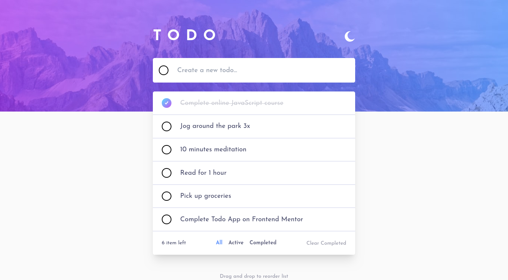

# Frontend Mentor - Todo app solution

This is a solution to the [Todo app challenge on Frontend Mentor](https://www.frontendmentor.io/challenges/todo-app-Su1_KokOW). Frontend Mentor challenges help you improve your coding skills by building realistic projects.

## Table of contents

- [Overview](#overview)
  - [The challenge](#the-challenge)
  - [Screenshot](#screenshot)
  - [Links](#links)
  - [Built with](#built-with)
  - [What I learned](#what-i-learned)
  - [Useful resources](#useful-resources)

## Overview

### The challenge

Users should be able to:

- View the optimal layout for the app depending on their device's screen size
- See hover states for all interactive elements on the page
- Add new todos to the list
- Mark todos as complete
- Delete todos from the list
- Filter by all/active/complete todos
- Clear all completed todos
- Toggle light and dark mode
- **Bonus**: Drag and drop to reorder items on the list

### Screenshot

### Links

- Solution URL: [Githup Solution](https://github.com/Osama-Alsafwani/Todo-app)
- Live Site URL: [Live Demo](https://Osama-Alsafwani.github.io/Todo-app/)

### Built with

- Semantic HTML5 markup
- CSS custom properties
- Flexbox
- CSS Grid
- Mobile-first workflow
- [React](https://reactjs.org/) - JS library
- [TypeScipt](https://typescriptlang.org/) - Javascript Tayped Language
- [Tailwind](https://tailwindcss.com/) - For styles

### What I learned

- Using Typesript with React
- Style with Tailwind
- Drag and Drop

### Useful resources

- [Sortable JS GitHub](https://github.com/SortableJS/react-sortablejs) - drag and drop.

